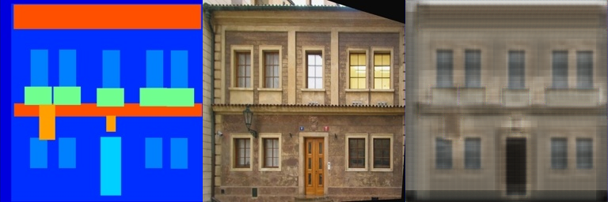
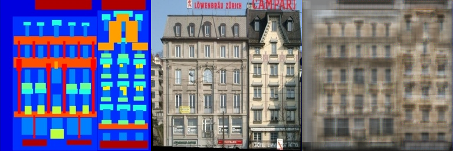
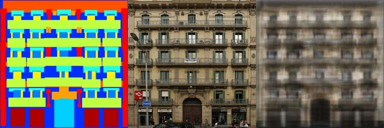
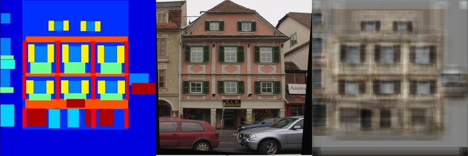
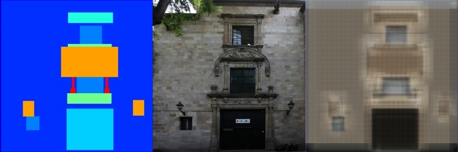

# Assaignment 2 -Pix2Pix

### 代码

1.下载 code.zip文件

2.运行：
```
bash download_facades_dataset.sh
python train.py
```

### 网络设计

与原论文类似，对称的编码器-解码器结构，形似字母"U"；跳跃连接(Skip Connection)机制，保留细节信息；同时多尺度特征融合，结合高层语义和低层细节。由于显存的原因，每层的通道数最大为256。

### 实验结果

训练700次后的结果图如下：











### 结果分析

由于考虑到训练时间和显存等多种因素，网络结构只设计了三次下采样共计8倍，每次均为3*3的卷积核，这可能导致实验结果有些模糊。但相比全卷积网络的结果，U-Net很好的保留了底层细节，即使在网络深度不足的情况下也取得了较好的效果。
