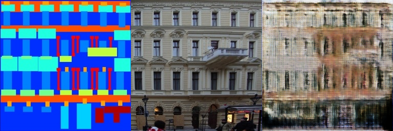
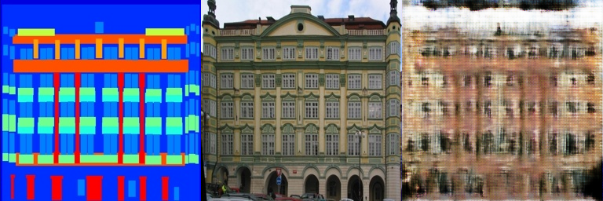
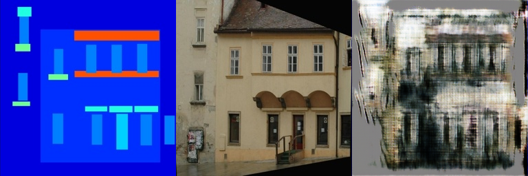
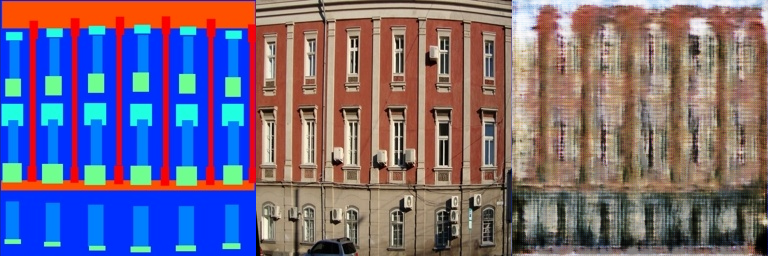
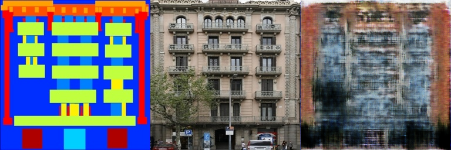
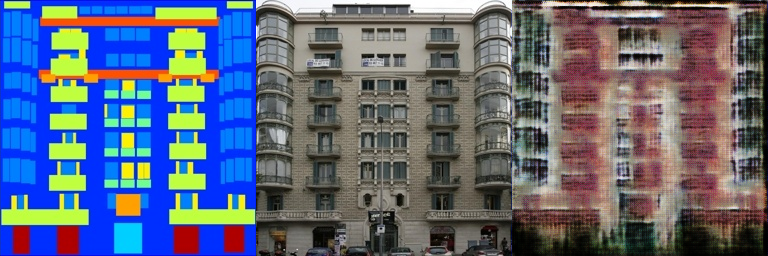
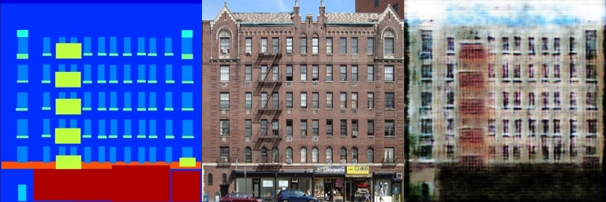
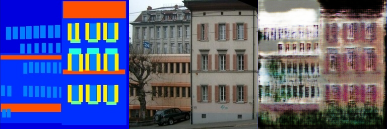
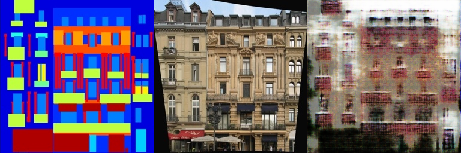
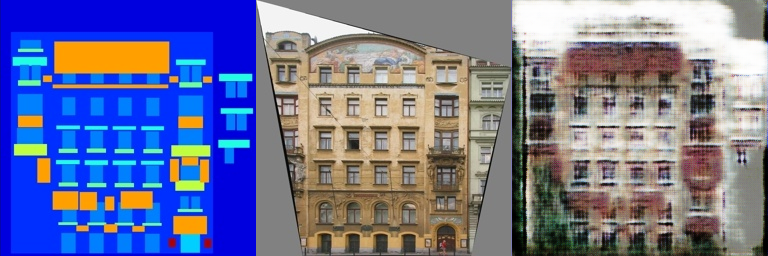

# PlayWithGANs

### 代码运行

```
bash download_facades_dataset.sh
python train.py
```

### 网络结构

与原论文相同，采用生成网络模型。代码框架与第二次作业基本相同，生成器仍采用U-net结构，判别器有四次下采样，一个4*4卷积层和一个全连接层组成，最后输出一个0到1之间的实数，作为得分。受限于显存，判别器全连接层的输入通道数为512，对于实验中的图像而言，提取的特征可能是不足的。

### 损失函数

损失函数由两部分组成：GAN_Loss和L1_Loss： L = L_GAN + lambda * L_L1

### 实验结果展示

lambda = 0.1， 此时以GAN_Loss为主，训练150次在测试集的结果如下：











lambda = 10， 此时GAN_Loss和L1_Loss在训练过程中的损失基本相同，训练150次在测试集的结果如下：











### 实验结果分析

由于训练较慢，因此只运行了150次，这可能导致实验结果出现较大的模糊；除此之外，判别器和生成器网络的设计受限于设备的显存，给定的图像（256*256*3）较大，这也可能导致训练效果的不理想。

