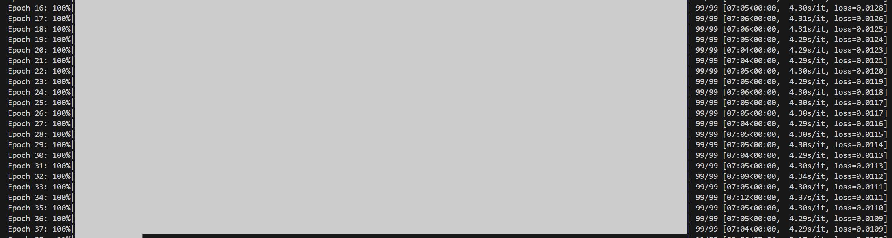
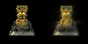

# 3DGS

### 实验过程

由于显存的限制, 实验中对从Colmap中得到的点云和输入的多视角图片进行了下采样, 具体来说, 对点云通过最远点采样得到了3000 个点, 对图片进行下采样使之分辨率为 
100×100(chair)和50x50(lego)。

由于本人的电脑为windows系统，安装pytorch3d是十分困难的，因此我们实际上没有使用 PyTorch3D，而是使用了自定义的渲染器实现。这是一个简化版的高斯渲染器实现，主要处理 3D 高斯点的投影和混合。

训练过程比较缓慢，例如训练lego数据集的时候，每次训练时间如下：

### 实验结果

lego训练20次的结果如下：
